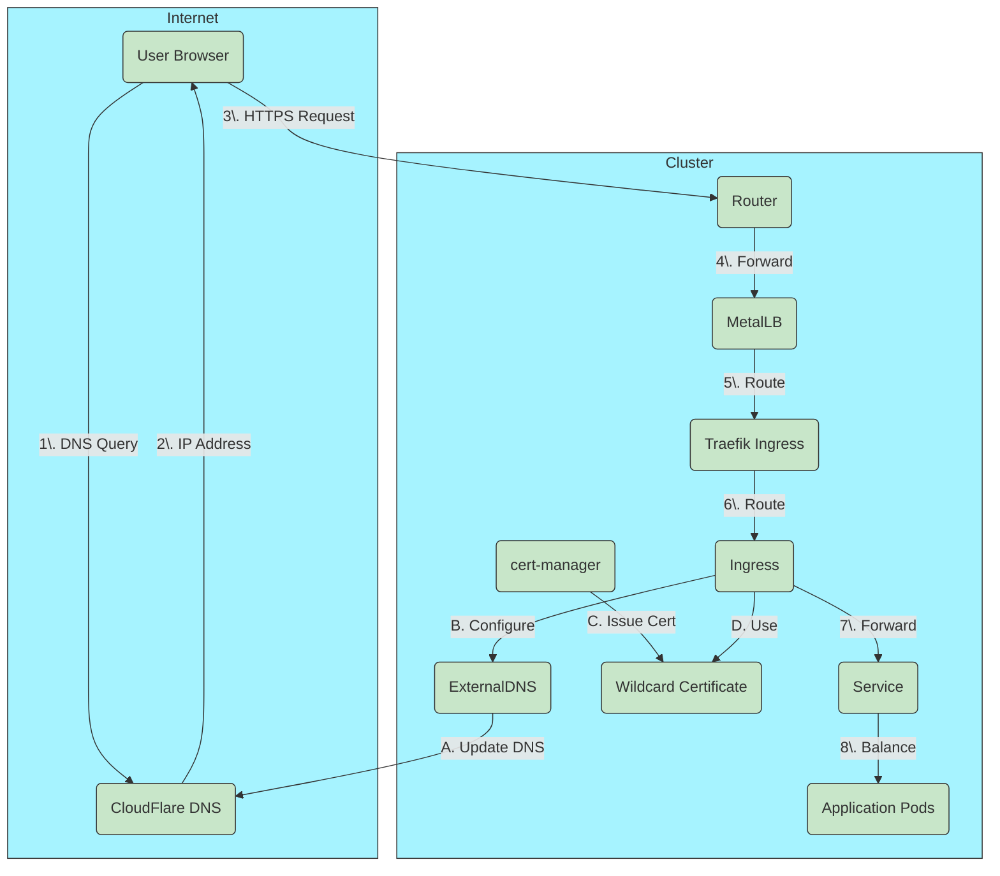

# Understanding Network Visibility in Kubernetes

This guide explains how applications deployed on our Kubernetes cluster become accessible from both internal and external networks. Whether you're deploying a public-facing website or an internal admin panel, this document will help you understand the journey from deployment to accessibility.

## The Visibility Pipeline

When you deploy an application to the cluster, making it accessible involves several coordinated components working together:

1. **Kubernetes Services** - Direct traffic to your application pods
2. **Ingress Controllers** - Route external HTTP/HTTPS traffic to services
3. **Load Balancers** - Assign external IPs to services
4. **DNS Management** - Map domain names to IPs
5. **TLS Certificates** - Secure connections with HTTPS

Let's walk through how each part works and how they interconnect.

## From Deployment to Visibility

### 1. Application Deployment

Your journey begins with deploying your application on Kubernetes. This typically involves:

```yaml
apiVersion: apps/v1
kind: Deployment
metadata:
  name: my-app
  namespace: my-namespace
spec:
  replicas: 1
  selector:
    matchLabels:
      app: my-app
  template:
    metadata:
      labels:
        app: my-app
    spec:
      containers:
        - name: my-app
          image: myapp:latest
          ports:
            - containerPort: 80
```

This creates pods running your application, but they're not yet accessible outside their namespace.

### 2. Kubernetes Service: Internal Connectivity

A Kubernetes Service provides a stable endpoint to access your pods:

```yaml
apiVersion: v1
kind: Service
metadata:
  name: my-app
  namespace: my-namespace
spec:
  selector:
    app: my-app
  ports:
    - port: 80
      targetPort: 80
  type: ClusterIP
```

With this `ClusterIP` service, your application is accessible within the cluster at `my-app.my-namespace.svc.cluster.local`, but not from outside.

### 3. Ingress: Defining HTTP Routes

For HTTP/HTTPS traffic, an Ingress resource defines routing rules:

```yaml
apiVersion: networking.k8s.io/v1
kind: Ingress
metadata:
  name: my-app
  namespace: my-namespace
  annotations:
    kubernetes.io/ingress.class: "traefik"
    external-dns.alpha.kubernetes.io/target: "CLOUD_DOMAIN"
    external-dns.alpha.kubernetes.io/ttl: "60"
spec:
  rules:
    - host: my-app.CLOUD_DOMAIN
      http:
        paths:
          - path: /
            pathType: Prefix
            backend:
              service:
                name: my-app
                port:
                  number: 80
  tls:
    - hosts:
        - my-app.CLOUD_DOMAIN
      secretName: wildcard-wild-cloud-tls
```

This Ingress tells the cluster to route requests for `my-app.CLOUD_DOMAIN` to your service. The annotations provide hints to other systems like ExternalDNS.

### 4. Traefik: The Ingress Controller

Our cluster uses Traefik as the ingress controller. Traefik watches for Ingress resources and configures itself to handle the routing rules. It acts as a reverse proxy and edge router, handling:

- HTTP/HTTPS routing
- TLS termination
- Load balancing
- Path-based routing
- Host-based routing

Traefik runs as a service in the cluster with its own external IP (provided by MetalLB).

### 5. MetalLB: Assigning External IPs

Since we're running on-premises (not in a cloud that provides load balancers), we use MetalLB to assign external IPs to services. MetalLB manages a pool of IP addresses from our local network:

```yaml
apiVersion: metallb.io/v1beta1
kind: IPAddressPool
metadata:
  name: default
  namespace: metallb-system
spec:
  addresses:
    - 192.168.8.240-192.168.8.250
```

This allows Traefik and any other LoadBalancer services to receive a real IP address from our network.

### 6. ExternalDNS: Automated DNS Management

ExternalDNS automatically creates and updates DNS records in our CloudFlare DNS zone:

```yaml
apiVersion: apps/v1
kind: Deployment
metadata:
  name: external-dns
  namespace: externaldns
spec:
  # ...
  template:
    spec:
      containers:
        - name: external-dns
          image: registry.k8s.io/external-dns/external-dns
          args:
            - --source=service
            - --source=ingress
            - --provider=cloudflare
            - --txt-owner-id=wild-cloud
```

ExternalDNS watches Kubernetes Services and Ingresses with appropriate annotations, then creates corresponding DNS records in CloudFlare, making your applications discoverable by domain name.

### 7. Cert-Manager: TLS Certificate Automation

To secure connections with HTTPS, we use cert-manager to automatically obtain and renew TLS certificates:

```yaml
apiVersion: cert-manager.io/v1
kind: Certificate
metadata:
  name: wildcard-wild-cloud-io
  namespace: default
spec:
  secretName: wildcard-wild-cloud-tls
  dnsNames:
    - "*.CLOUD_DOMAIN"
    - "CLOUD_DOMAIN"
  issuerRef:
    name: letsencrypt-prod
    kind: ClusterIssuer
```

Cert-manager handles:

- Certificate request and issuance
- DNS validation (for wildcard certificates)
- Automatic renewal
- Secret storage of certificates

## The Two Visibility Paths

In our infrastructure, we support two primary visibility paths:

### Public Services (External Access)

Public services are those meant to be accessible from the public internet:

1. **Service**: Kubernetes ClusterIP service (internal)
2. **Ingress**: Defines routing with hostname like `service-name.CLOUD_DOMAIN`
3. **DNS**: ExternalDNS creates a CNAME record pointing to `CLOUD_DOMAIN`
4. **TLS**: Uses wildcard certificate for `*.CLOUD_DOMAIN`
5. **IP Addressing**: Traffic reaches the MetalLB-assigned IP for Traefik
6. **Network**: Traffic flows from external internet → router → MetalLB IP → Traefik → Kubernetes Service → Application Pods

**Deploy a public service with:**

```bash
./bin/deploy-service --type public --name myservice
```

### Internal Services (Private Access)

Internal services are restricted to the internal network:

1. **Service**: Kubernetes ClusterIP service (internal)
2. **Ingress**: Defines routing with hostname like `service-name.internal.CLOUD_DOMAIN`
3. **DNS**: ExternalDNS creates an A record pointing to the internal load balancer IP
4. **TLS**: Uses wildcard certificate for `*.internal.CLOUD_DOMAIN`
5. **IP Addressing**: Traffic reaches the MetalLB-assigned IP for Traefik
6. **Network**: Traffic flows from internal network → MetalLB IP → Traefik → Service → Pods
7. **Security**: Traefik middleware restricts access to internal network IPs

**Deploy an internal service with:**

```bash
./bin/deploy-service --type internal --name adminpanel
```

## How It All Works Together

1. **You deploy** an application using our deploy-service script
2. **Kubernetes** schedules and runs your application pods
3. **Services** provide a stable endpoint for your pods
4. **Traefik** configures routing based on Ingress definitions
5. **MetalLB** assigns real network IPs to LoadBalancer services
6. **ExternalDNS** creates DNS records for your services
7. **Cert-Manager** ensures valid TLS certificates for HTTPS

### Network Flow Diagram



A successful deployment creates a chain of connections:

```
Internet → DNS (domain name) → External IP → Traefik → Kubernetes Service → Application Pod
```

## Behind the Scenes: The Technical Magic

When you use our `deploy-service` script, several things happen:

1. **Template Processing**: The script processes a YAML template for your service type, using environment variables to customize it
2. **Namespace Management**: Creates or uses your service's namespace
3. **Resource Application**: Applies the generated YAML to create/update all Kubernetes resources
4. **DNS Configuration**: ExternalDNS detects the new resources and creates DNS records
5. **Certificate Management**: Cert-manager ensures TLS certificates exist or creates new ones
6. **Secret Distribution**: For internal services, certificates are copied to the appropriate namespaces

## Troubleshooting Visibility Issues

When services aren't accessible, the issue usually lies in one of these areas:

1. **DNS Resolution**: Domain not resolving to the correct IP
2. **Certificate Problems**: Invalid, expired, or missing TLS certificates
3. **Ingress Configuration**: Incorrect routing rules or annotations
4. **Network Issues**: Firewall rules or internal/external network segregation

Our [Visibility Troubleshooting Guide](/docs/troubleshooting/VISIBILITY.md) provides detailed steps for diagnosing these issues.

## Conclusion

The visibility layer in our infrastructure represents a sophisticated interplay of multiple systems working together. While complex under the hood, it provides a streamlined experience for developers to deploy applications with proper networking, DNS, and security.

By understanding these components and their relationships, you'll be better equipped to deploy applications and diagnose any visibility issues that arise.

## Further Reading

- [Traefik Documentation](https://doc.traefik.io/traefik/)
- [ExternalDNS Project](https://github.com/kubernetes-sigs/external-dns)
- [Cert-Manager Documentation](https://cert-manager.io/docs/)
- [MetalLB Project](https://metallb.universe.tf/)
